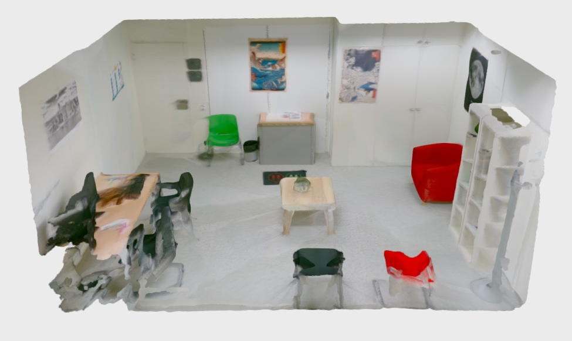
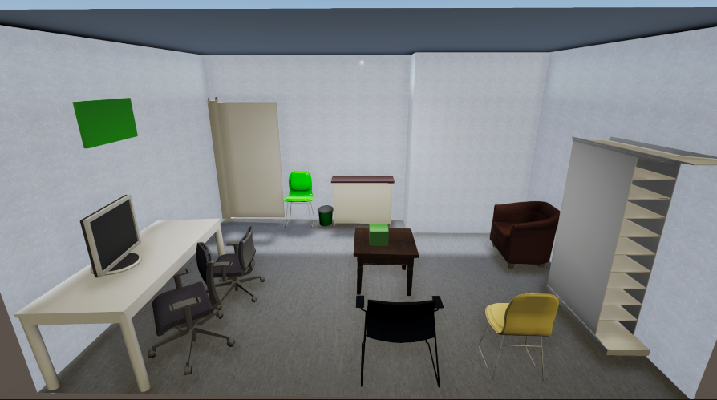

# VET-IndoorDataset

3D reconstruction of the scene | 3D virtualization using VET
:-------------------------:|:-------------------------:
|||

[](https://github.com/Pamogar/VET-IndoorDataset/blob/main/LICENSE.txt)

## Overview
VET-IndoorDataset is an open-source dataset that complements and is similar to the ScanNet dataset. It consists of multiple scenes with the
sensor data in a .sens file, containing the RGB-D images, the camera pose information and the camera intrinsics information, all the necessary information to generate a 3D reconstruction.
We recommend the use of ScanNet [SensReader](https://github.com/ScanNet/ScanNet/tree/master/SensReader) to read this files. Additionally, this
dataset contains an extra scene with the different steps of the virtualization, specifically: 3D reconstruction, 3D semantic
segmentation, layout, 3D instance segmentation and CAD alignment.The dataset focuses on indoor
environments of various sizes and types, providing valuable resources for computer vision and robotics research.

This README provides an overview of the dataset and instructions for accessing it.


## Original Paper
For detailed information about the dataset and the framework presented with it, please refer to the original paper (Currently on review):
- Virtual Experience Toolkit: An End-to-End Automated 3D Scene Virtualization Framework implementing Computer Vision Techniques

Temporarily, please refer to the conference publication:
- [Virtual Experience Toolkit: Enhancing 3D Scene Virtualization From Real Environments Through Computer Vision and Deep Learning Techniques](https://ieeexplore.ieee.org/abstract/document/10405757)

## Contents
The dataset consistes of various indoor scenes with the sensor data, along with an extra scene with the step-by-step results, with the following organization:
- room_demo
	- Sensor data (.sens file)
		- RGB-D images
		- Camera pose information
		- Camera intrinsics
	- 3D reconstructed scene
	- 3D semantic segmentation
	- Layout
	- 3D instance segmentation
	- CAD alignment
 - room_XXXX
 	- Sensor data (.sens file)
   		- RGB-D images
		- Camera pose information
		- Camera intrinsics

## Accessing the Dataset
The VET-IndoorDataset is hosted on OneDrive due to the large size. You can access and download the scenes following the next link:

[Download VET-IndoorDataset from OneDrive](https://upvedues-my.sharepoint.com/:f:/g/personal/pamogar_upv_edu_es/EkXtIVKaAltNkaleXeFLfZABZpTvqg6BDXhUDPDmm410qw?e=45wBNp)

## Citation
If you find VET-IndoorDataset useful for your research, please consider citing it:

```
Paper is now on review. The citation will be updated once the paper is published.
```

```
@INPROCEEDINGS{10405757,
  author={Garcia, Clara and Mora, Pau and Ortega, Mario and Ivorra, Eugenio and Valenza, Gaetano and Alcañiz, Mariano L.},
  booktitle={2023 IEEE International Conference on Metrology for eXtended Reality, Artificial Intelligence and Neural Engineering (MetroXRAINE)}, 
  title={Virtual Experience Toolkit: Enhancing 3D Scene Virtualization From Real Environments Through Computer Vision and Deep Learning Techniques}, 
  year={2023},
  volume={},
  number={},
  pages={694-699},
  keywords={Deep learning;Training;Computer vision;Solid modeling;Three-dimensional displays;Psychology;Virtualization;3D Scene Understanding;Indoor Scenes;Virtual Reality (VR);ScanNet;Scene Reconstruction},
  doi={10.1109/MetroXRAINE58569.2023.10405757}}
```

## License
This dataset is released under the [MIT License](https://github.com/Pamogar/VET-IndoorDataset/blob/main/LICENSE).


For any questions or concerns regarding the dataset, please feel free to contact the project maintainers.
