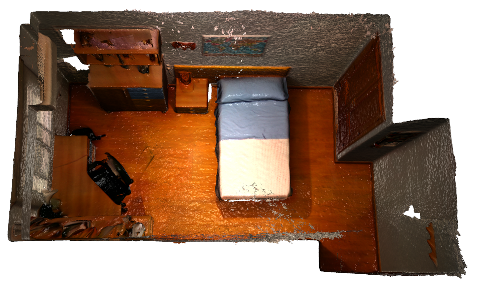
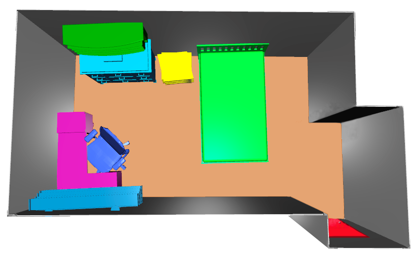

# VET-IndoorDataset

3D reconstruction of the scene | 3D virtualization using VET
:-------------------------:|:-------------------------:
|||

[](https://github.com/Pamogar/VET-IndoorDataset/blob/main/LICENSE.txt)

## Overview
VET-IndoorDataset is an open-source dataset that complements and is similar to the ScanNet dataset. It consists of the
sensor data in a .sens file, where the RGB-D images, the camera pose information, and the camera intrinsics can be extracted.
It also includes various steps of the virtualization, such as; 3D reconstructed scenes, 3D semantic segmentation results, layout results,
3D instance segmentation results and CAD alignment results for different scenes. The dataset focuses on indoor environments
of various sizes and types, providing valuable resources for computer vision and robotics research.

This README provides an overview of the dataset and instructions for accessing it. Temporary, a small sample of three scenes
is available for download.


## Original Paper
For detailed information about the dataset and the framework presented with it, please refer to the original paper (Currently on review):
- [Virtual Experience Toolkit: Enhancing 3D Scene Virtualization From Real Environments Through Computer Vision and Deep Learning Techniques](PLACEHOLDER_PAPER_LINK)

## Contents
The dataset consists of various indoor scenes, each one with the following information:
- Sensor data (.sens file)
	- RGB-D images
	- Camera pose information
	- Camera intrinsics
- 3D reconstructed scenes
- 3D semantic segmentation results
- Layout results
- 3D instance segmentation results
- CAD alignment results

## Accessing the Dataset
The sample for the VET-IndoorDataset is hosted on OneDrive due to the large size. You can access and download the 
sample scenes following the next link:

[Download VET-IndoorDataset from OneDrive](PLACEHOLDER_LINK)

## Citation
If you find VET-IndoorDataset useful for your research, please consider citing it:
```
Paper is now on review. The citation will be updated once the paper is published.
```

## License
This dataset is released under the [MIT License](https://github.com/Pamogar/VET-IndoorDataset/blob/main/LICENSE).


For any questions or concerns regarding the dataset, please feel free to contact the project maintainers.
